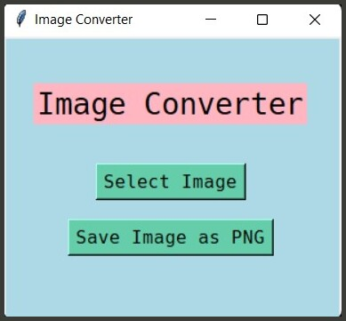

## 🖼️ Image Processing

### List of scripts:

**1.** Image Processing (Color Modes, Filters, Resizing, etc.): [**`Code`**](https://github.com/gkrockz/image-processing/blob/main/img_processing.py)

**2.** Image Converter (through console) `(jpg ~ png)`: [**`Code`**](https://github.com/gkrockz/image-processing/blob/master/imgConverter_cli.py)

**3.** Image Converter GUI`(jpg ~ png)`: [**`Code`**](https://github.com/gkrockz/image-processing/blob/master/imgConverter_gui.py)

 
 

---
📑 **Libary reference:** [**`Pillow`**](https://pypi.org/project/Pillow/) 
